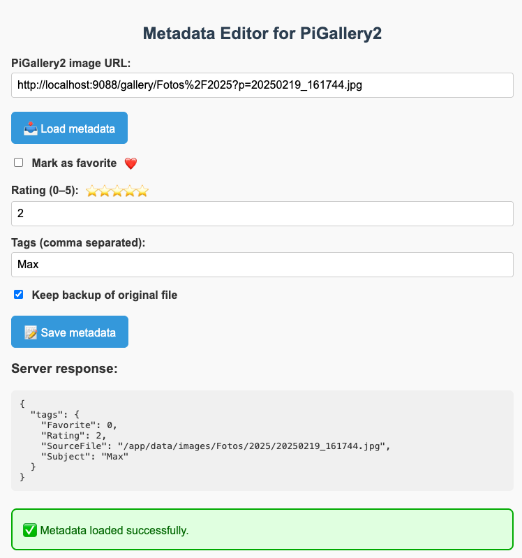
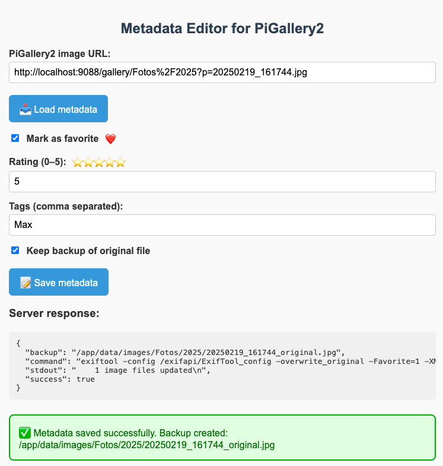

# pigallery2-metadata-editor

A web-based metadata editor for [PiGallery2](https://github.com/bpatrik/pigallery2) that allows reading and writing XMP metadata (such as **Favorite**, **Rating**, and **Tags**) directly from the browser – using [ExifTool](https://exiftool.org) in the background. All this is accomplished **without modifying the PiGallery2 codebase**, ensuring long-term compatibility with upstream updates.

## Why?

Although PiGallery2 is designed as a **read-only** photo gallery (a wise decision for safety), I often find myself wanting to make quick adjustments to photo and video metadata – especially when viewing pictures on the web.

For example, I use the [F-Stop Gallery app](https://www.fstopapp.com) on Android to organize and tag my photos and videos directly on the phone. F-Stop uses a custom XMP tag (`XMP-fstop:Favorite`) to mark favorites. While this works great on mobile, I wanted a way to adjust this **Favorite** tag (as well as Ratings and Tags) directly while browsing photos and videos in PiGallery2 – without having to go back to the phone.

### Key Benefits:
- Tag or rate photos and videos directly in your browser while viewing them in PiGallery2.
- Immediate visual updates in PiGallery2 after saving metadata – no restart or rescan necessary.
- Modified files synced back to mobile (e.g. F-Stop) show updated tags instantly.
- Safe: all changes are performed via `exiftool`, optionally with a backup created.
- This setup leaves the PiGallery2 source **completely untouched**, so you benefit from future updates without merge conflicts.


## Architecture

This project uses a single Docker container that exposes:
- Port `9088` for PiGallery2
- Port `${METADATA_API_PORT}` (default: `9089`) for the metadata API

The metadata editor consists of:
- A small Flask API (`app.py`)
- A static web UI (`ui/index.html`, `ui/script.js`)
- A custom `ExifTool_config` file (only needed for the **Favorite** tag used by F-Stop)
- A `Dockerfile` to build the extended PiGallery2 image
- A `docker-compose.yml` file to bring everything up together

## Setup

You can build and start everything with:

```bash
cd src
docker-compose up -d --build
```


### Configuration Notes

You must provide valid volume mappings in `docker-compose.yml` for the following paths to ensure PiGallery2 works correctly.
Make sure to map your image folders in `docker-compose.yml` to `/app/data/images/...`, as this is where both PiGallery2 and the metadata editing API expect them to reside.

```yaml
volumes:
  - "<YOUR_PIGALLERY2_DB_PATH>:/app/data/db"         # Path to your PiGallery2 SQLite database
  - "<YOUR_PIGALLERY2_CONFIG_PATH>:/app/data/config" # Path to your PiGallery2 config directory
  - "<YOUR_PIGALLERY2_TMP_PATH>:/app/data/tmp"       # Path used for temp file storage
  - "<YOUR_PIGALLERY2_IMAGES_PATH>:/app/data/images" # Path to your photo/video folders
```

Replace the `<YOUR_PIGALLERY2_...>` placeholders with paths on your host system that point to your actual PiGallery2 directories and media.

Example `ports` section:

```yaml
ports:
  - "9088:80"     # PiGallery2 frontend
  - "9089:9089"   # Metadata API
```

Your [start.sh](./src/exifapi/start.sh) should ensure that the metadata API is listening on the same internal port as defined here:

```bash
#!/bin/bash

METADATA_API_PORT=9089

...
```

## UI

Access the web UI via:

```
http://<your-host>:<METADATA_API_PORT>/meta
```

From there, you can:
- Paste the PiGallery2 image URL
- Read or update tags (Favorite, Rating, Tags)
- Optionally create a backup of the file before modifying

### Bookmarklet

If you are too lazy to copy & paste the PiGallery2 image URL, just add a bookmark to your browser with the following content. 
Replace `<METADATA_API_PORT>` by your metadata-API port.
Click this bookmark while viewing a specific photo or video in PiGallery2 to open the metadata editor prefilled already with the right image URL. 

```javascript
javascript:(function(){
  const p = new URL(window.location.href);
  if (p.pathname.includes('/gallery') || p.pathname.includes('/search')) {
    const base = p.origin.replace(/:\d+$/, ':<METADATA_API_PORT>');
    const target = base + '/meta/index.html?img=' + encodeURIComponent(p.href);
    window.open(target, '_blank');
  } else {
    alert('Not a PiGallery2 image, search or album page');
  }
})();
```

## Screenshot of loaded metadata



## Screenshot of saved metadata


 

## ExifTool Config

The file `ExifTool_config` is required **only** to support the `XMP-fstop:Favorite` tag used by the F-Stop Android app. You may extend this file to define additional custom tags.

## License

MIT

